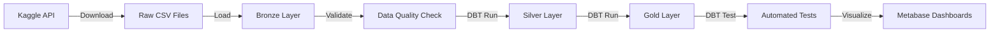

# 🏪 E-Commerce Data Warehouse - Pipeline ETL Completo


> Pipeline de dados automatizado para análise de e-commerce brasileiro utilizando arquitetura moderna de Data Engineering com orquestração Airflow, transformações DBT e modelagem em camadas (Bronze/Silver/Gold).

---

## 📋 Índice

- [Visão Geral](#-visão-geral)
- [Arquitetura](#-arquitetura)
- [Stack Tecnológica](#-stack-tecnológica)
- [Estrutura do Projeto](#-estrutura-do-projeto)
- [Como Executar](#-como-executar)
- [Pipeline de Dados](#-pipeline-de-dados)
- [Modelagem de Dados](#-modelagem-de-dados)
- [Dashboards](#-dashboards)
- [Melhorias Futuras](#-melhorias-futuras)

---

## 🎯 Visão Geral

Este projeto implementa um **Data Warehouse completo** para análise de dados de e-commerce, desde a ingestão automatizada até dashboards analíticos, seguindo as melhores práticas de Engenharia de Dados.

### Principais Funcionalidades

✅ **Ingestão Automatizada** - Download diário de dados via Kaggle API  
✅ **Arquitetura Medalion** - Camadas Bronze/Silver/Gold para governança  
✅ **Transformações DBT** - Modelagem declarativa com testes automatizados  
✅ **Orquestração Airflow** - Pipeline agendado com retry e monitoramento  
✅ **Data Quality** - Validações em cada etapa do pipeline  
✅ **Containerização** - Ambiente 100% reproduzível com Docker  
✅ **Dashboards** - Visualizações interativas com Metabase  

### Casos de Uso

- 📊 Análise de vendas por região
- 💰 Customer Lifetime Value (CLV)
- 📈 Tendências temporais de receita
- 🗺️ Mapeamento geográfico de clientes
- ⭐ Análise de reviews e satisfação

---

## 🏗️ Arquitetura
```
┌─────────────────┐
│   Kaggle API    │  ← Fonte de Dados
└────────┬────────┘
         │
    ┌────▼────┐
    │ Airflow │  ← Orquestração
    └────┬────┘
         │
┌────────▼─────────────────────────────┐
│         PostgreSQL Warehouse         │
│  ┌──────────────────────────────┐   │
│  │  🥉 Bronze (Raw Data)        │   │
│  │  • customers                 │   │
│  │  • orders                    │   │
│  │  • order_items               │   │
│  │  • products                  │   │
│  │  • sellers                   │   │
│  │  • payments                  │   │
│  │  • reviews                   │   │
│  └──────────────────────────────┘   │
│           │ DBT Transformations      │
│  ┌────────▼──────────────────────┐  │
│  │  🥈 Silver (Cleaned)          │  │
│  │  • silver_customers           │  │
│  │  • silver_orders              │  │
│  │  • silver_order_items         │  │
│  │  • silver_products            │  │
│  └───────────────────────────────┘  │
│           │ DBT Analytics            │
│  ┌────────▼──────────────────────┐  │
│  │  🥇 Gold (Business Metrics)   │  │
│  │  • gold_sales_by_state        │  │
│  │  • gold_customer_ltv          │  │
│  └───────────────────────────────┘  │
└──────────────┬───────────────────────┘
               │
         ┌─────▼─────┐
         │ Metabase  │  ← Visualização
         └───────────┘
```

---

## 🛠️ Stack Tecnológica

| Categoria | Tecnologia | Versão |
|-----------|-----------|--------|
| **Orquestração** | Apache Airflow | 2.8.1 |
| **Transformação** | DBT Core | 1.7.7 |
| **Database** | PostgreSQL | 14 |
| **Visualização** | Metabase | latest |
| **Linguagem** | Python | 3.11 |
| **Containerização** | Docker / Docker Compose | 24+ |
| **Ingestão** | Kaggle API | 1.6.6 |
| **Data Processing** | Pandas | 2.0.3 |
| **Data Quality** | Great Expectations | 0.18.8 |

---

## 📁 Estrutura do Projeto
```
data-warehouse-project/
├── 📂 airflow/
│   ├── dags/
│   │   └── ecommerce_etl.py          # DAG principal do pipeline
│   ├── logs/                          # Logs de execução
│   └── plugins/                       # Plugins customizados
│
├── 📂 dbt_project/
│   ├── models/
│   │   ├── bronze/                    # Sources
│   │   ├── silver/                    # Transformações limpeza
│   │   │   ├── silver_customers.sql
│   │   │   ├── silver_orders.sql
│   │   │   └── silver_order_items.sql
│   │   └── gold/                      # Métricas de negócio
│   │       ├── gold_sales_by_state.sql
│   │       └── gold_customer_ltv.sql
│   ├── dbt_project.yml
│   └── profiles.yml
│
├── 📂 data/
│   └── raw/                           # Dados brutos do Kaggle
│
├── 📄 docker-compose.yml              # Orquestração de containers
├── 📄 Dockerfile                      # Imagem customizada Airflow
├── 📄 requirements.txt                # Dependências Python
├── 📄 init-db.sql                     # Inicialização PostgreSQL
└── 📄 README.md
```

---

## 🚀 Como Executar

### Pré-requisitos

- Docker Desktop 24+ 
- 8GB RAM disponível
- 10GB espaço em disco
- Conta Kaggle (gratuita)

### 1️⃣ Clonar o Repositório
```bash
git clone https://github.com/RSangDev/ecommerce-data-warehouse.git
cd ecommerce-data-warehouse
```

### 2️⃣ Configurar Credenciais Kaggle
```bash
# Obter API token em https://www.kaggle.com/settings
# Criar diretório .kaggle na raiz do projeto
mkdir .kaggle

# Adicionar arquivo kaggle.json com suas credenciais
echo '{"username":"seu_username","key":"sua_key"}' > .kaggle/kaggle.json
```

### 3️⃣ Subir o Ambiente
```bash
# Windows PowerShell
echo "AIRFLOW_UID=50000" | Out-File -FilePath .env -Encoding ASCII

# Buildar imagem customizada
docker-compose build

# Subir PostgreSQL
docker-compose up -d postgres

# Aguardar 30 segundos
Start-Sleep -Seconds 30

# Inicializar Airflow
docker-compose up airflow-init

# Subir todos os serviços
docker-compose up -d
```

### 4️⃣ Acessar Interfaces

| Serviço | URL | Credenciais |
|---------|-----|-------------|
| **Airflow** | http://localhost:8080 | `airflow` / `airflow` |
| **Metabase** | http://localhost:3000 | Criar na primeira vez |
| **PostgreSQL** | `localhost:5432` | `airflow` / `airflow` |

### 5️⃣ Executar Pipeline

1. Acesse Airflow UI (http://localhost:8080)
2. Localize DAG `ecommerce_etl_pipeline`
3. Ative o toggle (se pausada)
4. Clique em "Trigger DAG"
5. Acompanhe execução no Graph View

**Tempo estimado de execução**: 10-15 minutos

---

## 🔄 Pipeline de Dados

### Fluxo Completo


### Tasks da DAG

| # | Task | Descrição | Duração |
|---|------|-----------|---------|
| 1 | `download_kaggle_dataset` | Download e extração do dataset | ~3 min |
| 2 | `load_to_bronze_layer` | Carga raw em PostgreSQL | ~2 min |
| 3 | `validate_bronze_layer` | Validação de qualidade | ~10s |
| 4 | `dbt_run` | Transformações Silver/Gold | ~1 min |
| 5 | `dbt_test` | Testes automatizados | ~30s |

---

## 📊 Modelagem de Dados

### Camada Bronze (Raw)

Dados brutos sem transformação, com metadados de carga:

- `customers` - 99.4k registros
- `orders` - 99.4k registros  
- `order_items` - 112.6k registros
- `products` - 32.9k registros
- `sellers` - 3.1k registros
- `payments` - 103.9k registros
- `reviews` - 99.2k registros

### Camada Silver (Cleaned)

Dados limpos e padronizados:
```sql
-- Exemplo: silver_customers
SELECT
    customer_id,
    customer_unique_id,
    UPPER(TRIM(customer_city)) AS customer_city,
    UPPER(TRIM(customer_state)) AS customer_state,
    transformed_at
FROM bronze.customers
WHERE customer_id IS NOT NULL
```

**Transformações aplicadas:**
- ✅ Remoção de nulls críticos
- ✅ Padronização de texto (UPPER, TRIM)
- ✅ Conversão de tipos de dados
- ✅ Deduplicação

### Camada Gold (Analytics)

Métricas agregadas para análise de negócio:

**1. Sales by State**
```sql
customer_state | order_month | total_orders | total_revenue
---------------|-------------|--------------|---------------
SP             | 2018-08     | 12,543      | R$ 2.1M
RJ             | 2018-08     | 5,231       | R$ 890K
```

**2. Customer LTV**
```sql
customer_id | lifetime_value | total_orders | avg_order_value
------------|---------------|--------------|------------------
abc123      | R$ 5,432      | 8            | R$ 679
```

---

## 📈 Dashboards

### Principais Visualizações

1. **🗺️ Mapa de Vendas por Estado**
   - Heatmap geográfico
   - Drill-down por cidade
   - Filtro temporal

2. **💰 Top Clientes (CLV)**
   - Ranking de lifetime value
   - Segmentação por ticket médio
   - Análise de recência

3. **📊 Evolução Temporal**
   - Receita mensal
   - Sazonalidade
   - Taxa de crescimento

4. **⭐ Análise de Reviews**
   - NPS Score
   - Palavras mais frequentes
   - Correlação rating × entrega

### Configurar Metabase
```sql
-- 1. Conectar ao banco
Host: postgres
Database: warehouse
User: airflow
Password: airflow

-- 2. Criar Questions com queries SQL
-- 3. Combinar em Dashboard
-- 4. Agendar atualizações
```

---

## 🎯 Principais Aprendizados

Este projeto demonstra:

✅ **Arquitetura Medallion** - Implementação de camadas Bronze/Silver/Gold  
✅ **ELT Moderno** - DBT para transformações SQL declarativas  
✅ **Orquestração** - Airflow para pipelines robustos com retry  
✅ **Data Quality** - Validações automatizadas em cada camada  
✅ **IaC** - Infraestrutura como código com Docker  
✅ **Versionamento** - Modelos DBT sob controle Git  
✅ **Testes** - Suite automatizada com DBT  
✅ **Documentação** - Autogerada via DBT docs  

---

## 🔮 Melhorias Futuras

### Curto Prazo
- [ ] Adicionar alertas Slack em falhas
- [ ] Implementar incremental loads (CDC)
- [ ] Dashboard de monitoramento do pipeline
- [ ] CI/CD com GitHub Actions

### Médio Prazo
- [ ] Adicionar Apache Spark para big data
- [ ] Implementar Data Lakehouse (Delta Lake)
- [ ] ML para previsão de demanda

### Longo Prazo
- [ ] Migrar para AWS/GCP (Redshift/BigQuery)
- [ ] Streaming com Apache Kafka
- [ ] Feature Store para ML

---

## 📚 Referências

- [Airflow Documentation](https://airflow.apache.org/docs/)
- [DBT Best Practices](https://docs.getdbt.com/guides/best-practices)
- [Kimball Dimensional Modeling](https://www.kimballgroup.com/)
- [Dataset Olist](https://www.kaggle.com/datasets/olistbr/brazilian-ecommerce)

---

## 📝 Licença

Este projeto é open-source sob licença MIT.

---

## 👤 Autor
[](https://github.com/RSangDev)
[](https://rsangdev.github.io/portfolio_proj/)
---

⭐ **Star este projeto se ele te ajudou!**